# Diagrams

Rhizome supports Mermaid diagrams for creating flowcharts, sequence diagrams, class diagrams, and more. Diagrams render in both light and dark modes.

## Usage

Use fenced code blocks with the `mermaid` language identifier:

````
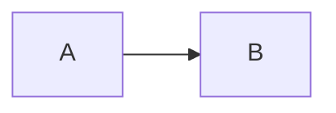
````

Renders as:


Optionally add a title:

````

````

Renders as:


<Callout type="tip">
Diagrams automatically switch between light and dark themes based on your site preference.
</Callout>

## Flowcharts

### Left to Right

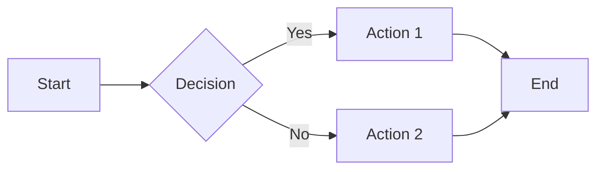

### Top to Bottom

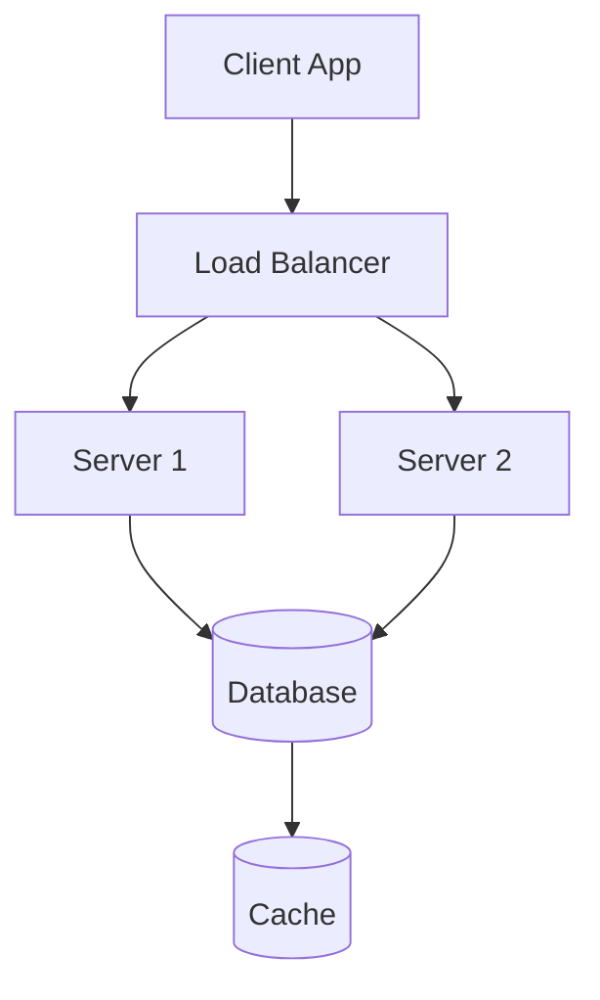

### System Architecture

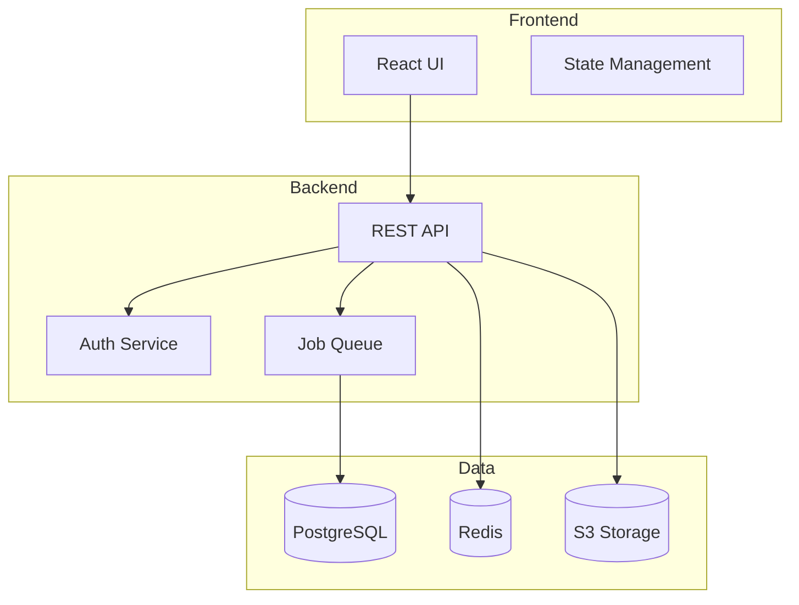

## Sequence Diagrams

Perfect for visualizing API interactions and processes:

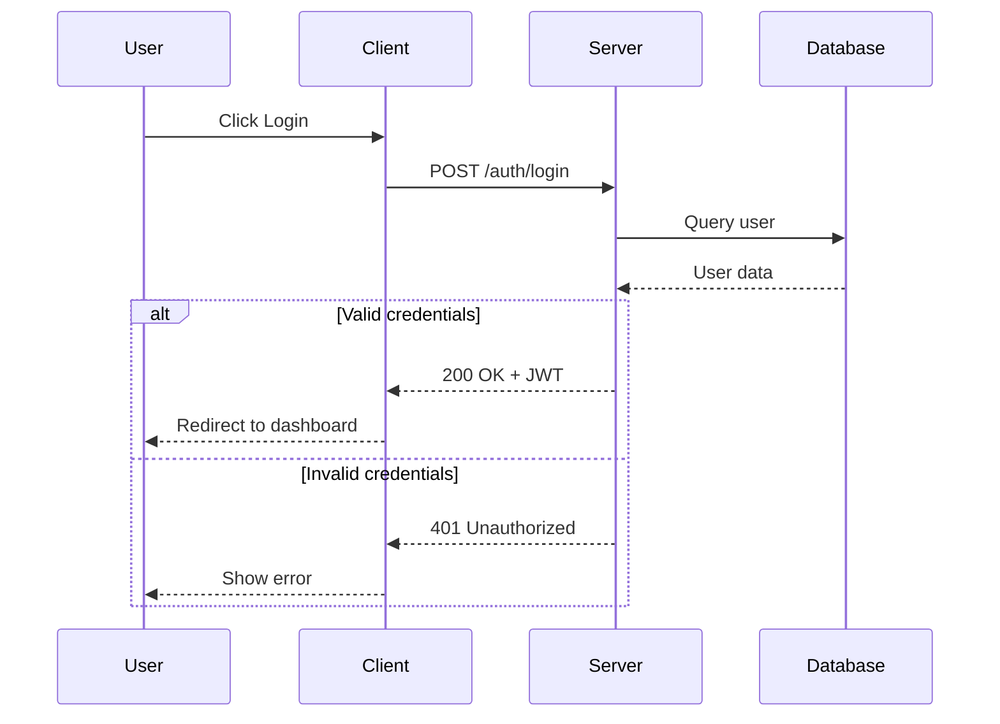

### Authentication Flow

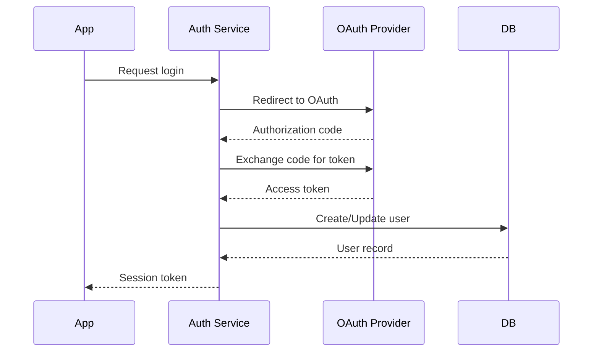

## Class Diagrams

Useful for object-oriented design documentation:

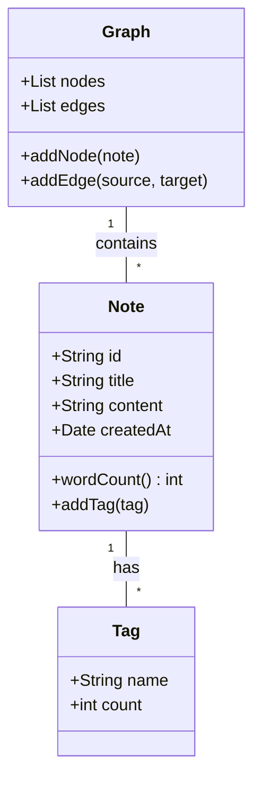

## State Diagrams

Model state machines and workflows:

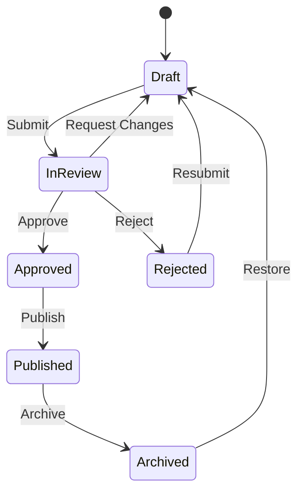

## Entity Relationship Diagrams

Document database schemas:

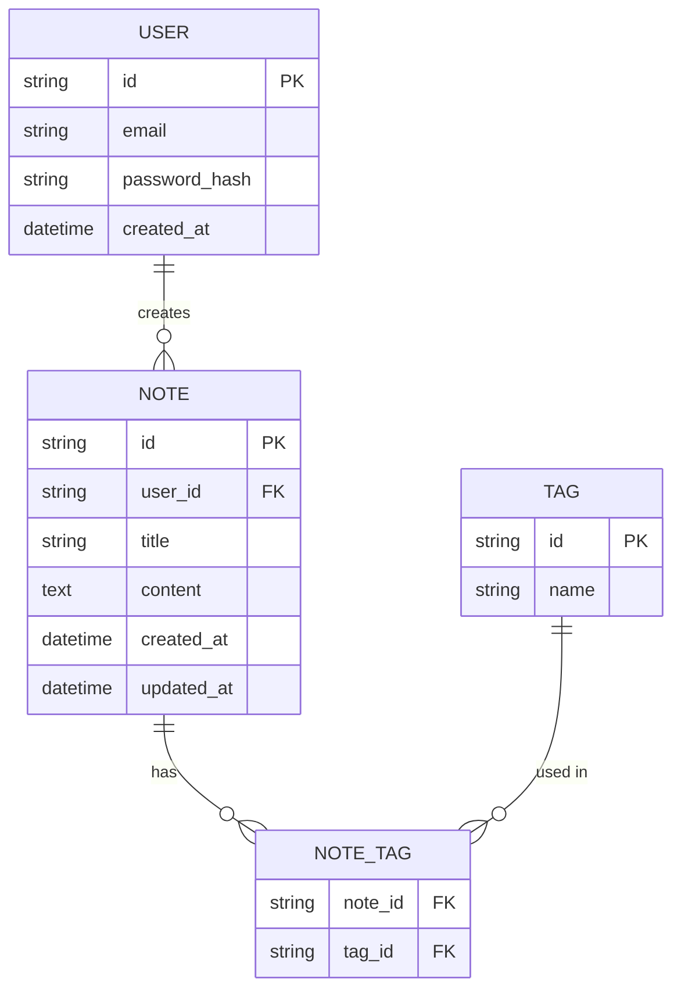

## Pie Charts

Show proportional data:

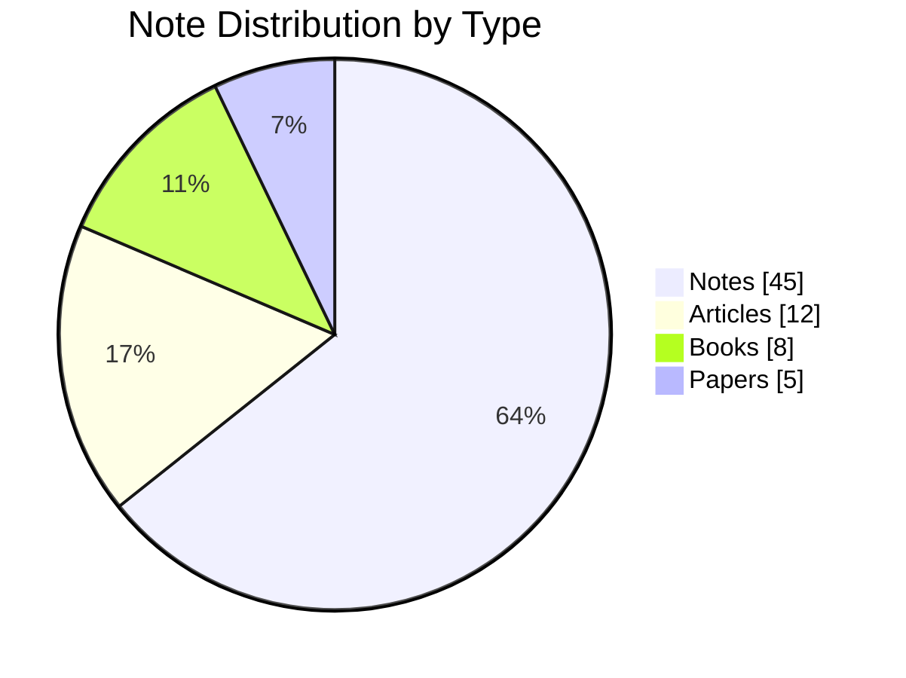

## Git Graphs

Visualize branching and merge history:

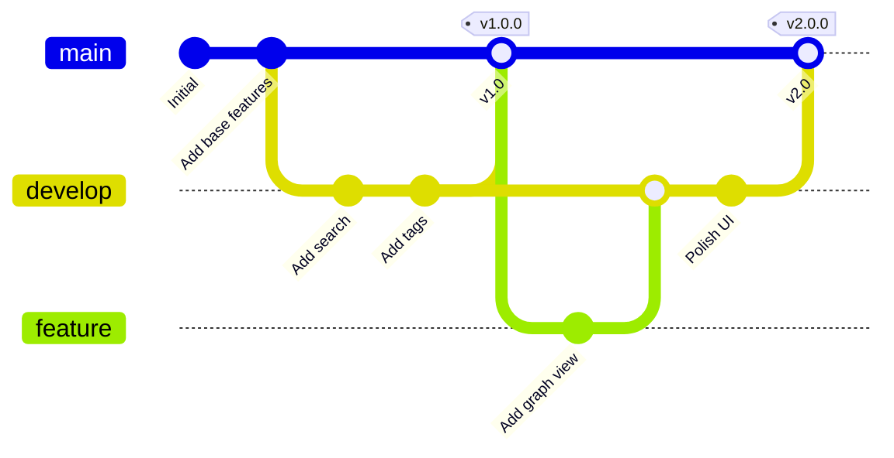

## Mindmaps

Organize hierarchical concepts:

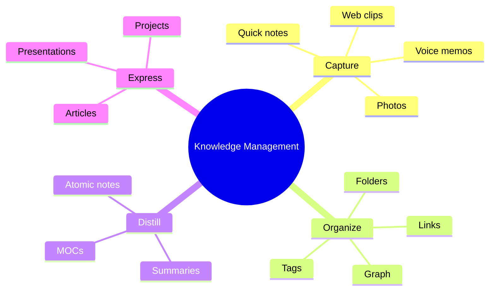

## Diagram Syntax Reference

| Diagram Type | Keyword |
|--------------|---------|
| Flowchart | `graph` or `flowchart` |
| Sequence | `sequenceDiagram` |
| Class | `classDiagram` |
| State | `stateDiagram-v2` |
| ER | `erDiagram` |
| Pie | `pie` |

<Callout type="note" title="Resources">
Full Mermaid documentation is available at [mermaid.js.org](https://mermaid.js.org/). The site includes a live editor for testing diagrams.
</Callout>

## Mathematical Diagrams

For commutative diagrams (category theory, algebra), use KaTeX's `CD` environment instead of Mermaid — it produces cleaner, mathematically-formatted output:

See [[Mathematical Notation#Commutative Diagrams]] for commutative diagram syntax.
